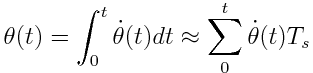

# Inertia Measurement Unit (IMU)

The `mpu6050` has an i2c interface, reading raw sensor values from both
gyroscope and accelerometer data is the easy part, the harder part involves
combining both sensor data in-order to obtain a more reliable drivers
orientation. In the following we will detail how we first calculate the drivers
orientation angles from both the gyroscope and accelerometer, then once we have
the angles we combine them using the complimentary filter.

**Contents**:
- Calculate the drivers Angle from Gyroscope Data
- Calculate the drivers Angle from Accelerometer Data
- Complimentary Filter

## Calculate the drivers Angle from Gyroscope Data

The raw sensor values from the gyroscope are in degrees per second, this is the
rate of change of the angular position over time (angular velocity). If we
integrate this angular velocity we can obtain the angular position (or the
angle we want).

In code we can calculate the angle from gyroscope data like so:

    #include <time.h>
    #include <math.h>

    int main(void)
    {
        double angle;
        double dt;
        clock_t start;
        clock_t end;

        /* setup */
        angle = 0;
        start = clock();

        while (1) {
            /* calculate dt */
            end = clock();
            dt = ((double) (end - start)) / CLOCKS_PER_SEC;

            /* get angle from gyroscope */
            angle = gyro_get_x();  /* your custom get function */

            /* calculate angle by integration */
            angle += angle * dt;

            /* update start time */
            start = clock();
        }

        return 0;
    }

This however is subject to rounding errors, this is why more accurate
approximations such as Runge Kutta (RK4) was devised. For our purposes we used
the complimentary filter to mitigate errors (which will be explained below).

## Calculate the drivers Angle from Accelerometer Data

    angle x = arctan(x / sqrt(pow(y, 2), pow(z, 2)))
    angle y = arctan(y / sqrt(pow(x, 2), pow(z, 2)))

For full derivation see [this document][1].

In code we can calculate the angle from gyroscope data like so:

    #include <math.h>

    int main(void)
    {
        double x;
        double y;
        double z;

        double angle_x;
        double angle_y;
        double angle_z;

        /* setup */
        angle_x = 0;
        angle_y = 0;
        angle_z = 0;

        while (1) {
            /* get angle from accelerometer sensor */
            x = accel_get_x();  /* your custom get function */
            y = accel_get_y();  /* your custom get function */
            z = accel_get_z();  /* your custom get function */

            angle_x = arctan(x / sqrt(pow(y, 2), pow(z, 2)))
            angle_y = arctan(y / sqrt(pow(x, 2), pow(z, 2)))
        }

        return 0;
    }

## Complimentary Filter

So far we have covered how to calculate the angle from using gyroscope and
accelerometer data. However simply using either one of them for the drivers
angle is not advisable, because:

- **Gyroscope**: is slow in sensing short term movements, but stable in
  the long run. Additionally it has a sensor drift.
- **Accelerometer**: on the other hand is sensitive to short term movements
  but too sensitive for a control systems to rely on, the readings have a
  relatively large variance compared to gyroscope readings.

The complementary filter combines both long and short term benefits from the
gyroscope and accelerometer to obtain the best of two worlds.

[1]: http://cache.freescale.com/files/sensors/doc/app_note/AN3461.pdf?fpsp=1
