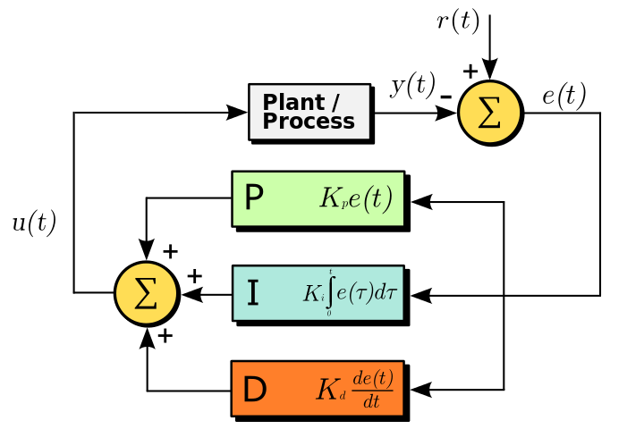

# PID Controller
Source: [Wikipedia][1]

A proportional-integral-derivative controller (PID controller) is a control
loop feedback mechanism (controller) widely used in industrial control systems.
A PID controller calculates an error value as the difference between a measured
process variable and a desired set point. The controller attempts to minimize
the error by adjusting the process through use of a manipulated variable.

The PID control is named after its three correcting terms. The proportional,
integral and derivative terms are summed to calculate the output of the PID
controller.

## Proportional Term
Produces an output value proportional to the current error value. It can be
adjusted by multiplying the error by a constant K_p, called the proportional
gain constant.

However just the proportional term is not enough, as the system output y will
always be less then the desired setpoint value, this is known as proportional
droop. This is because for the proportional term to produce a zero output in
the steady state it must receive a zero input, but most systems require a
non-zero input in the steady state.

## Integral Term
To mitigate proportional droop and steady-state errors, the integral term is
used. The strategy of the integral term is to calculate the accumulated error,
and accelerate the moment of the process towards the setpoint to eliminates
residual stead-state errors from using just the proportional term.

However, since the integral term responds to accumulated errors from the past,
it can cause the present value to overshoot the setpoint value.

## Derivative Term
Unlike the proportional and integral terms which looks at the present and past
errors, the derivative term predicts system behaviour and thus improves
settling time and stability of the system.

The derivative of the process error is calculated by determining the slope of
the error over time and multiplying this rate of change by the derivative gain.
The magnitude of the contribution of the derivative term to the overall control
action is termed the derivative gain.

[1]: https://en.wikipedia.org/wiki/PID_controller
